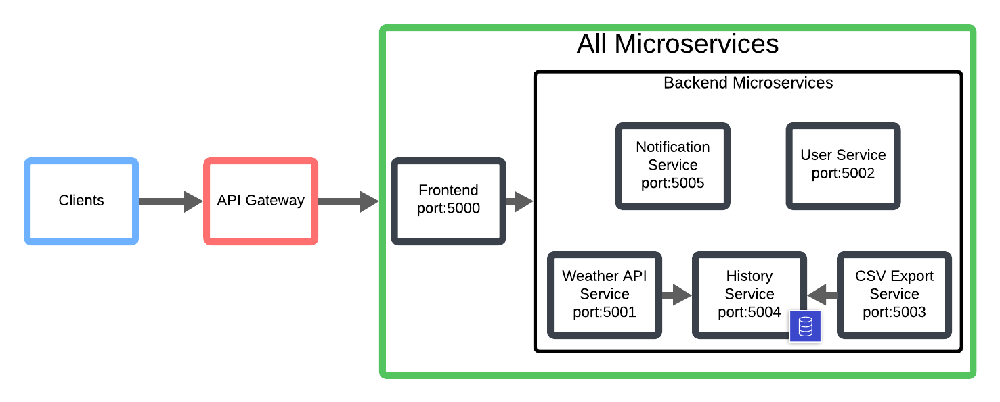

# Microservice Weather App (Cloud Computing Project)

This is a cloud-native weather app using a microservices architecture. Users can register and log in, search current weather conditions by city, store and retrieve the history of weather conditions, be alerted for abnormal weather conditions, and export the history of queries on weather conditions as CSV.

Each of the features is developed as a standalone microservice with their own Dockerfiles, and the entire system is containerized with Docker and combined with Docker Compose. The microservices communicate with one another via HTTP and REST API, demonstrating crucial aspects of cloud computing such as service decoupling, container-based deployment, and inter-service communication.

The system pulls live weather data with the OpenWeatherMap API and caches it in a dedicated history service. End-users can interact with the application through a plain Flask-based frontend or respective ports for dedicated microservices. Already queried weather data history can be exported on demand using a dedicated CSV export service.

This project was made as part of the "Intro to Cloud Computing (CS-452/CS-552)" course at Binghamton University in Spring 2025 for learning to apply cloud computing technologies into a real world project. The purpose of this project therefore lies in employing and understanding microservices and its architecture implementation as opposed to a real functioning weather app itself. The frontend and the functionalities of the weather app are thus very barebones.

## Motivation and Goal
The goal of this project was to apply a key concept cloud computing by building a containerized application composed of independently deployable microservices. Rather than developing a single monolithic application, we wanted to develop an application using microservice architecture to learn about service orchestration using Docker Compose, inter-service communication via REST APIs, and container-based deployment workflows.

By the end of the project, we wanted to be able to:

- Design and implement a microservice architecture

- Deploy and manage containerized services using Docker Compose

- Persist and retrieve structured data using a real database

- Demonstrate how microservices can collaboratively deliver a complete user-facing product

This project served as a practical foundation for understanding how cloud-native systems are designed, deployed, and maintained in real-world environments.

## System Architecture and Microservices

The application follows a modular microservices architecture, with each service responsible for a specific part of the system's functionality. All services are containerized using Docker and orchestrated using Docker Compose. Below is a high-level diagram of the final system we envision (all microservices are implemented but some are not fully integrated in the app yet):



The entry point for all user interactions is the frontend service running on port 5000. It serves HTML templates and JavaScript, manages user sessions, and acts as a gateway to backend services. Authenticated users can search for weather by city, view current conditions, and download historical query data. But the microservices are also avilable without the frontend by accessing their port directly.

| Service              | Port | Description                                                                                                                  |
| -------------------- | ---- | ---------------------------------------------------------------------------------------------------------------------------- |
| Weather API Service  | 5001 | Fetches current weather from OpenWeatherMap. Logs each request to the history service and optionally triggers notifications (the notification service has yet to be integrated into the weather API service). |
| History Service      | 5004 | Stores queried weather logs in a SQLite database. Provides a REST API for retrieving logs by city or all data.                  |
| CSV Export Service   | 5003 | Retrieves query history from the history service and generates downloadable CSV files.                                     |
| User Service         | 5002 | Handles user registration and login. (Currently uses in-memory storage and not a real database).                                |
| Notification Service | 5005 | Analyzes weather descriptions and prints alerts for severe conditions like storms or extreme heat (not integrated in the architecture yet)                    |

Each service communicates internally via HTTP using Docker Compose's built-in service discovery (e.g., the frontend uses http://weather:5001 internally to contact the weather API service).

All microservices are stateless (except the database in the history service). Services can be replaced or extended independently without affecting the rest of the system.

### API Endpoints per Microservice
Each microservice exposes its own HTTP endpoints that are accessed either by the frontend or by other backend services via internal service URLs.

#### Weather API Service (port: 5001)
| Method | Endpoint               | Description                                                                                                                                                |
| ------ | ---------------------- | ---------------------------------------------------------------------------------------------------------------------------------------------------------- |
| GET    | /get\_weather?city=... | Fetches current weather data for the specified city using OpenWeatherMap. Also logs the result to the History Service. |

```
{
  "city": "Berlin",
  "temperature_celsius": 14.5,
  "description": "clear sky",
  "humidity": 55,
  "timestamp": "2025-04-17T14:22:00Z"
}
```

#### User Service (port: 5002)
| Method | Endpoint  | Description                                                      |
| ------ | --------- | ---------------------------------------------------------------- |
| POST   | /register | Registers a new user. Expects JSON with username and password.   |
| POST   | /login    | Authenticates a user. Returns 200 OK if credentials are correct. |

#### CSV Export Service (port: 5003)
| Method | Endpoint             | Description                                                                                                      |
| ------ | -------------------- | ---------------------------------------------------------------------------------------------------------------- |
| GET    | /export?city=...     | Generates a CSV from historical weather data for a given city or all cities. Returns a link to download the CSV. |
| GET    | /download/\<filename\> | Provides download access to a previously generated CSV download link.                                                     |
#### History Service (port: 5004)
| Method | Endpoint          | Description                                                                                                     |
| ------ | ----------------- | --------------------------------------------------------------------------------------------------------------- |
| POST   | /log              | Accepts a weather log from the Weather Service (includes city, date, time, temperature, humidity, description). |
| GET    | /history?city=... | Retrieves weather logs for a specific city. If no city is provided, returns logs for all cities.                |

#### Notification Service (port: 5005)
| Method | Endpoint | Description                                                             |
| ------ | -------- | ----------------------------------------------------------------------- |
| POST   | /notify  | Analyzes weather descriptions and prints alerts for extreme conditions (still in development) |

## Docker Setup & Deployment 
To simplify deployment and achieving independent microservices that can still communicate with each other, the entire application is containerized using Docker and combined using Docker Compose.

Each microservice (frontend, weather-service, user-service, history-service, csv-export-service, notification-service) has its own Dockerfile and runs in its own isolated container. These containers communicate via a shared Docker network using service names defined in the docker-compose.yml file.

The project includes a docker-compose.yml file that defines and connects all services. It handles:

- Building images from each service’s Dockerfile

- Networking (each service can reach others by name, e.g. http://weather:5001)

- Port mapping to expose services

To start the entire prject with all its microservices, use:
```
docker-compose up --build
```
This will build and start all service containers and allow you to access the microservices at http://localhost:\<port>

To stop and clean up:
```
docker-compose down
```

The OpenWeatherMap API key is passed via environment variables using a .env file.
```
API_KEY=your_openweathermap_api_key
```
Make sure to create a .env file in the root directory and the weather-service directory before running docker-compose.

## TODOs

- [ ] integrate history service into the frontend
- [ ] integrate csv-export-service into the frontend
- [ ] integrate notification service into the architecture
- [ ] use a real database for user-service
- [ ] integrate user-service with history service (users should only be able to look up their own search history)

## Contributions
Ngo Tuan Kiet: Docker Setup, Weather API Service, History Service, CSV Export Service

Abir Hida: Frontend, Weather API Service

Niraj P.: User Aand Notification Service

